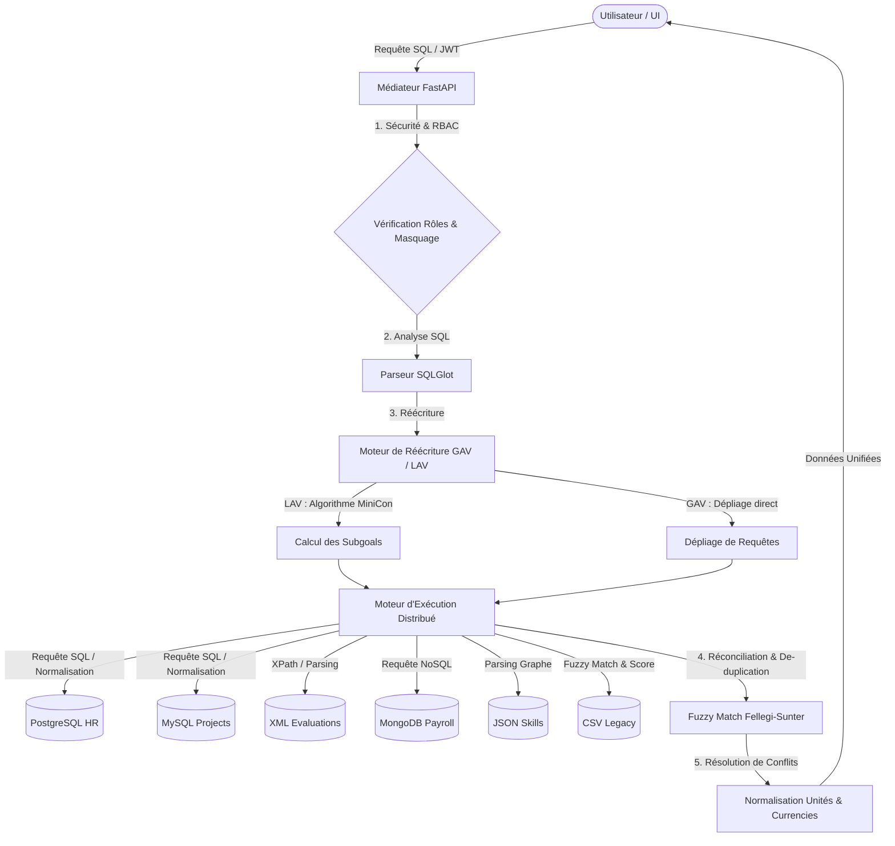

# DataMediator Pro 🚀

> **Médiation virtuelle intelligente de données hétérogènes (RH / Projets / Finance)** — Une solution d'intégration à l'état de l'art combinant les approches **GAV**, **LAV (MiniCon)**, la **Réconciliation d'entités** et une sécurité **RBAC avancée**.

[](https://www.python.org/)
[](https://react.dev/)
[](https://fastapi.tiangolo.com/)
[](https://www.docker.com/)
[](https://opensource.org/licenses/MIT)

---

## 📖 Sommaire
1. [Présentation & Concept](#1-présentation--concept)
2. [Architecture Technique & Théorie](#2-architecture-technique--théorie)
3. [Architecture des Répertoires](#3-architecture-des-répertoires)
4. [Fonctionnalités Clés](#4-fonctionnalités-clés)
5. [Démarrage Rapide](#5-démarrage-rapide)
6. [Identifiants & Rôles (RBAC)](#6-identifiants--rôles-rbac)
7. [Administration des Bases (Mode Docker)](#7-administration-des-bases-mode-docker)
8. [Tests & Qualité](#8-tests--qualité)

---

## 1. Présentation & Concept

**DataMediator** est un médiateur de données virtuel qui unifie des sources d'informations hétérogènes (ressources humaines, projets, finances) **sans duplication ni stockage physique centralisé**. 

Le système expose un **schéma global virtuel unique** (unifié) et traduit en temps réel les requêtes SQL des utilisateurs vers les différentes sources autonomes.

### 🌐 Sources hétérogènes intégrées :
*   **🐘 PostgreSQL** (Système RH principal - Données sur les employés)
*   **🐬 MySQL** (Gestion des projets - Affectations et statuts)
*   **🍃 MongoDB** (Finance et Payroll - Contrats et salaires en documents)
*   **📄 CSV Legacy** (Données historiques RH à réconcilier)
*   **🧬 XML** (Évaluations de performance via XPath)
*   **🕸️ JSON/Graphe** (Compétences techniques des collaborateurs)

---

## 2. Architecture Technique & Théorie

Le projet résout les problématiques fondamentales de l'intégration de données à l'aide de modèles mathématiques et algorithmiques éprouvés :



### 🔬 Piliers Théoriques :
*   **GAV (Global-As-View)** : Les tables du schéma global sont définies comme des vues sur les sources locales. La réécriture se fait par simple dépliage de l'arbre de syntaxe SQL.
*   **LAV (Local-As-View)** : Les sources locales sont définies comme des vues sur le schéma global. Le médiateur utilise le puissant algorithme **MiniCon** (plus performant que l'algorithme Bucket) pour trouver des réécritures maximales à l'aide de conjonctions de vues.
*   **Réconciliation d'Entités** : Utilise une heuristique inspirée de la théorie de **Fellegi-Sunter** pour détecter et fusionner les doublons d'employés répartis sur plusieurs sources (ex: comparaison floue du nom et rapprochement par e-mail).
*   **Résolution de Conflits de Valeurs** : Convertit dynamiquement les formats hétérogènes (ex: format des noms `Prénom NOM` vs `NOM, Prénom`) et les devises financières (`EUR` ou `DZD` vers `USD`) en s'appuyant sur les taux configurés.

---

## 3. Architecture des Répertoires

```struct
├── .github/workflows/      # CI/CD (GitHub Actions)
├── data/                   # SQLite d'émulation (mode local) & données brutes
├── docs/                   # Documentation théorique et technique poussée
├── frontend/               # Application Web SPA (React, Vite, CSS Premium)
│   ├── src/
│   │   ├── components/     # Composants d'interface (GlowCards, Toast, Theme)
│   │   ├── pages/          # Pages (Dashboard, Console SQL, RBAC, Conflits)
│   │   └── viz/            # Visualisations de graphes et heatmaps
├── sources/                # Scripts d'initialisation et mocks de données
├── tests/                  # Tests unitaires, d'intégration et E2E
│   ├── unit/               # Tests du médiateur et de l'algorithme MiniCon
│   ├── integration/        # Tests des routes de l'API REST
│   └── e2e/                # Tests de flux utilisateur (Playwright)
├── enterprise_mediator.py  # Moteur d'intégration (GAV, LAV, Réconciliation)
├── main.py                 # Serveur FastAPI et routage de l'application
├── mini_con.py             # Algorithme MiniCon complet
├── monitoring.py           # Logique de monitoring & détection d'alertes
├── requirements.txt        # Dépendances Python
└── start.ps1               # Script de démarrage rapide unifié (Windows)
```

---

## 4. Fonctionnalités Clés

*   **⚡ Console SQL Interactive** : Saisie libre de requêtes SQL avec auto-complétion, coloration syntaxique et historique.
*   **🔍 Explain Plan Visuel** : Examinez comment le médiateur réécrit votre requête SQL globale en requêtes sources (visualisation de l'arbre syntaxique).
*   **🧬 Résolution interactive des conflits** : Dashboard permettant de voir les conflits détectés (doublons, formats, incohérences de salaires) et de définir des règles de résolution.
*   **🔒 Sécurité RBAC & Masquage** : Le médiateur intercepte la requête SQL et élimine les colonnes interdites du schéma global *avant* de générer le plan d'exécution physique.
*   **📈 Dashboard de Monitoring** : Indicateurs de performance (débit, temps de réponse en ms) et état de santé des sources avec système d'alertes en temps réel.
*   **🪵 Audit Trail Complet** : Toutes les requêtes et tentatives d'accès non autorisées sont tracées dans une base d'audit cryptée.

---

## 5. Démarrage Rapide

### Option A — Mode local léger (Recommandé pour tester rapidement)
Ce mode émule les bases de données réelles à l'aide de bases SQLite locales. Aucune installation Docker n'est nécessaire.

1.  Ouvrez une console **PowerShell** en tant qu'administrateur.
2.  Exécutez le script automatique de démarrage :
    ```powershell
    .\start.ps1
    ```
    *Le script installera les dépendances Python/Node, configurera les bases d'émulation SQLite et démarrera le serveur FastAPI (port 5001) ainsi que le Frontend React (port 3000).*

---

### Option B — Mode Production (Bases Réelles avec Docker)
Ce mode utilise de vrais conteneurs PostgreSQL, MySQL et MongoDB pour refléter une infrastructure réelle.

1.  **Démarrer l'infrastructure de bases de données** :
    ```bash
    docker compose up -d
    ```
2.  **Activer la variable d'environnement Docker** :
    *   Sur Windows (PowerShell) :
        ```powershell
        $env:USE_DOCKER = "True"
        ```
    *   Sur Linux/macOS :
        ```bash
        export USE_DOCKER="True"
        ```
3.  **Lancer le script d'initialisation des sources** :
    ```bash
    python sources/setup_enterprise_sources.py
    ```
4.  **Lancer le backend** :
    ```bash
    python -m uvicorn main:app --host 0.0.0.0 --port 5001 --reload
    ```
5.  **Démarrer le frontend** :
    ```bash
    cd frontend
    npm install
    npm run dev
    ```

---

## 6. Identifiants & Rôles (RBAC)

Vous pouvez vous connecter à la plateforme sur `http://localhost:3000` en utilisant l'un des rôles de démonstration suivants :

| Rôle | Utilisateur | Mot de passe | Permissions de données |
| :--- | :--- | :--- | :--- |
| **Administrateur** | `admin` | `admin123` | Accès complet sans restrictions (RH, Projets, Finance, Graphe, XML). |
| **RH Manager** | `hr` | `hr123` | Accès aux données RH et Projets. Les colonnes financières sensibles sont masquées. |
| **Chef de Projet** | `project` | `project123` | Accès aux projets et affectations. Accès partiel aux employés (salaires masqués). |
| **Finance Officer** | `finance` | `finance123` | Accès complet aux finances (salaires, budgets) et données de base des employés. |
| **Lecteur Simple** | `viewer` | `viewer123` | Lecture seule restreinte aux relations publiques non sensibles. |

---

## 7. Administration des Bases (Mode Docker)

Lorsque les conteneurs Docker fonctionnent, vous pouvez accéder à leurs interfaces graphiques d'administration web intégrées :

### 🐘 Adminer (PostgreSQL & MySQL)
*   **URL** : [http://localhost:8080](http://localhost:8080)
*   **Identifiants PostgreSQL** :
    *   Système : `PostgreSQL`
    *   Serveur : `datamediator_postgres_hr`
    *   Utilisateur : `mediator_hr` | Mot de passe : `mediator_hr_pwd`
    *   Base : `hr_db`
*   **Identifiants MySQL** :
    *   Système : `MySQL`
    *   Serveur : `datamediator_mysql_projects`
    *   Utilisateur : `mediator_projects` | Mot de passe : `mediator_projects_pwd`
    *   Base : `project_db`

### 🍃 Mongo Express (MongoDB Finance)
*   **URL** : [http://localhost:8081](http://localhost:8081)
*   Visualisez directement les contrats et salaires de la base `finance_db` et sa collection `payroll`.

---

## 8. Tests & Qualité

Le projet intègre une suite robuste de tests pour valider la logique du médiateur :

```bash
# Lancer tous les tests unitaires et d'intégration
pytest

# Exécuter uniquement les tests unitaires (MiniCon, réconciliation, calcul des conflits)
pytest tests/unit

# Exécuter les tests d'intégration (API REST, JWT, RBAC)
pytest tests/integration

# Exécuter les tests E2E avec Playwright (nécessite que le projet tourne)
pytest tests/e2e
```

---
*Projet académique d'excellence développé dans le cadre du module d'Intégration de Données.*
