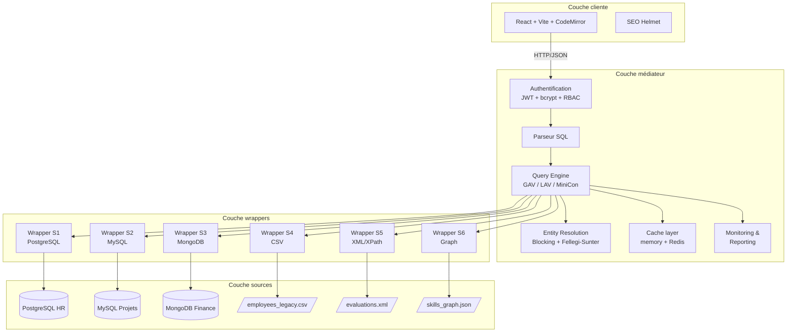
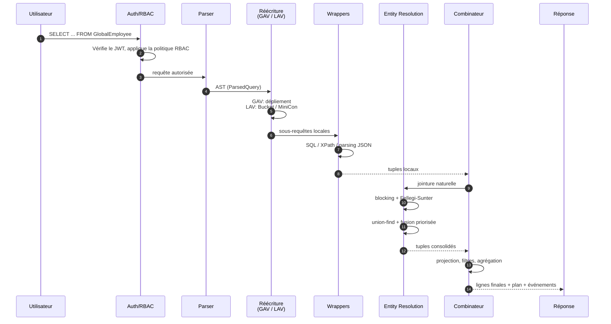
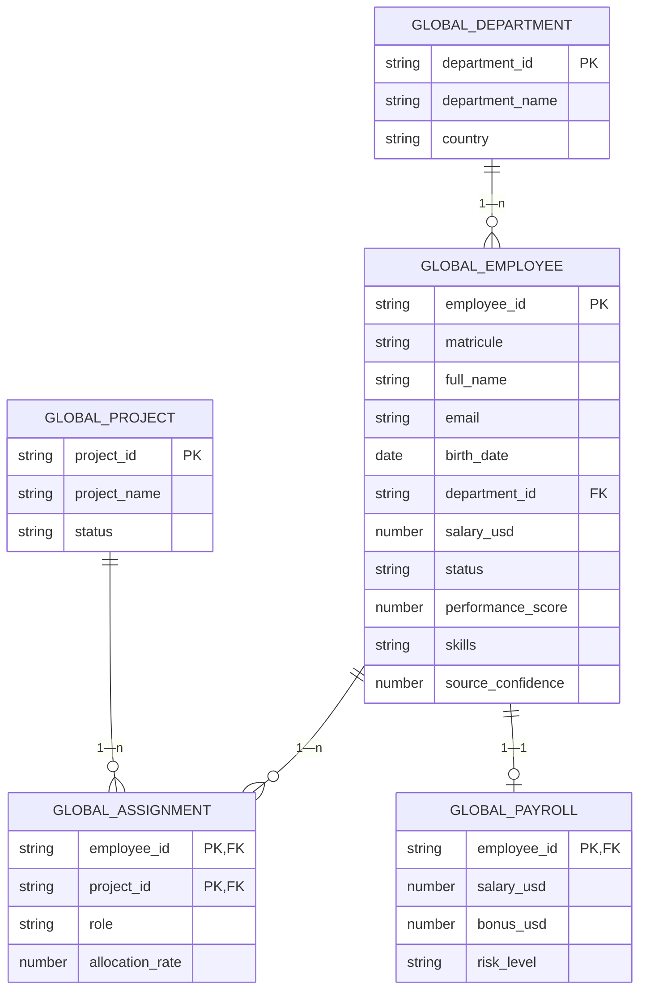
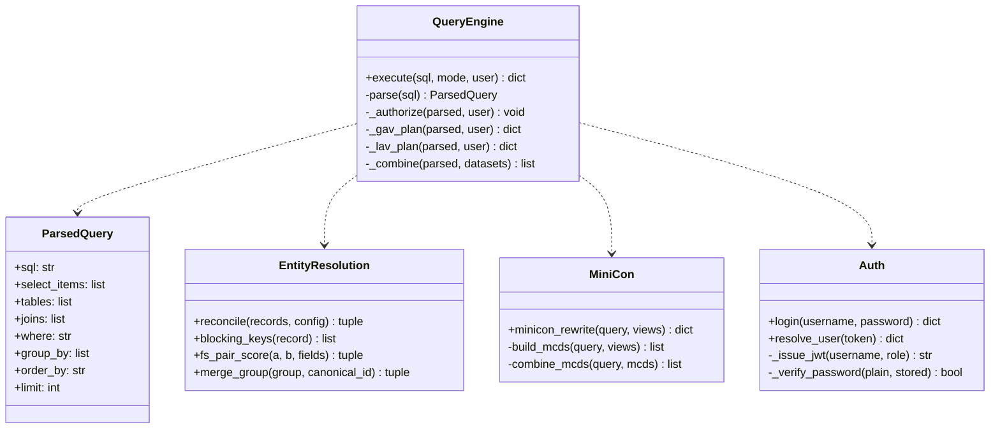

# Architecture de DataMediator

> Vue d'ensemble en couches du médiateur virtuel, des wrappers et du frontend.

---

## 1. Architecture en couches (Wiederhold 1992)

**Trois couches du médiateur classique** :

- **Couche cliente** : pose des requêtes en SQL global, ignore tout des sources.
- **Couche médiateur** : authentifie, autorise, parse, réécrit (GAV ou LAV), exécute le plan, réconcilie, met en cache.
- **Couche wrappers** : convertit les requêtes locales en SQL/XPath/traversée de graphe, harmonise les types et les noms.
- **Couche sources** : six SGBD/fichiers hétérogènes simulés ou réels (Docker).

---

## 2. Pipeline d'exécution d'une requête

---

## 3. Modèle conceptuel des données (schéma global)

---

## 4. Cartographie sources → schéma global

| Source | Modèle natif | Couvre |
|--------|-------------|--------|
| **S1** PostgreSQL HR  | Relationnel | `GlobalEmployee` (identité, salaire EUR), `GlobalDepartment` |
| **S2** MySQL Projets  | Relationnel | `GlobalEmployee` (consultants), `GlobalProject`, `GlobalAssignment` |
| **S3** Mongo Finance  | Document JSON | `GlobalPayroll` (salaires DZD) |
| **S4** CSV legacy     | Fichier plat | `GlobalEmployee` (employés historiques) |
| **S5** XML évaluations| Semi-structuré | `GlobalEmployee.performance_score` |
| **S6** Graphe JSON    | Graphe `(:Employee)-[:KNOWS]->(:Skill)` | `GlobalEmployee.skills` |

---

## 5. Diagramme de classes (Python — backend)

---

## 6. Choix d'architecture et trade-offs

| Choix | Justification |
|-------|---------------|
| **FastAPI** plutôt que Flask | Typage Pydantic, ASGI, Swagger auto, async natif. |
| **SQLite local** par défaut | Démo reproductible, zéro dépendance. Docker en option. |
| **Wrappers en fonctions** plutôt que classes | Simplicité pédagogique, moins de boilerplate. |
| **Cache memory** + fallback | Pas de dépendance dure à Redis. |
| **JWT + bcrypt** | Sécurité standard, expiration des tokens. |
| **MiniCon + Bucket** | Bucket pour la pédagogie, MiniCon pour la performance. |
| **React + Vite** | Hot reload, ESM natif, build rapide. |
| **CSS custom + tokens** | Pas de framework lourd (Tailwind utilisé minimalement). |
