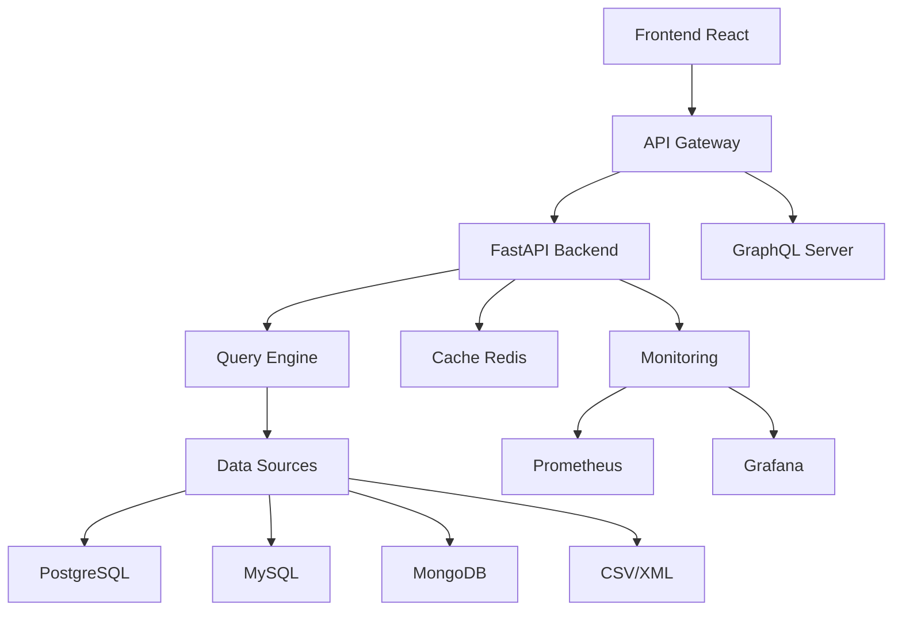

# DataMediator - Documentation Interactive


> **DataMediator** est une plateforme complète de médiation et d'intégration de données multi-sources avec des fonctionnalités avancées d'analyse, de monitoring et de reporting.

## 🚀 Démarrage Rapide

### Prérequis

- Python 3.11+
- Node.js 20+
- Docker & Docker Compose
- PostgreSQL 15+
- MySQL 8+
- MongoDB 7+

### Installation

```bash
# Cloner le projet
git clone https://github.com/your-org/datamediator-pro.git
cd datamediator-pro

# Démarrer les services
docker-compose up -d

# Installer les dépendances Python
pip install -r requirements.txt

# Installer les dépendances Frontend
cd frontend && npm install && cd ..

# Démarrer l'application
uvicorn main:app --host 0.0.0.0 --port 5001
```

### Accès

- **Application**: http://localhost:3001
- **API REST**: http://localhost:5001
- **API GraphQL**: http://localhost:5002
- **Documentation**: http://localhost:5001/docs
- **Monitoring**: http://localhost:3001/monitoring

## 📖 Table des Matières

- [Architecture](./architecture.md)
- [API Reference](./api.md)
- [Configuration](./configuration.md)
- [Déploiement](./deployment.md)
- [Développement](./development.md)
- [Tutoriels](./tutorials.md)
- [FAQ](./faq.md)

## 🏗️ Architecture

DataMediator utilise une architecture microservices avec :

- **Backend FastAPI**: API REST et GraphQL
- **Frontend React**: Interface utilisateur moderne
- **Moteur de Médiation**: GAV/LAV approaches
- **Multi-Sources**: PostgreSQL, MySQL, MongoDB, CSV, XML
- **Cache Intelligent**: Redis avec fallback mémoire
- **Monitoring**: Prometheus + Grafana
- **Tests**: Pytest + Playwright



## 🔧 Fonctionnalités Principales

### 📊 Tableau de Bord Analytics
- Métriques en temps réel
- Graphiques interactifs
- Alertes intelligentes
- Export multi-formats

### 💡 Éditeur SQL Intelligent
- Auto-complétion
- Coloration syntaxique
- Historique des requêtes
- Favoris personnalisés

### 🔄 Gestion des Conflits
- Détection automatique
- Résolution interactive
- Règles personnalisables
- Historique des résolutions

### 🚀 Performance
- Cache distribué
- Monitoring avancé
- Health checks
- Load balancing

### 📈 Reporting
- Rapports personnalisés
- Export CSV/Excel/PDF
- Planification automatique
- Templates réutilisables

## 🎯 Cas d'Usage

### Intégration d'Entreprise
Unifiez les données de vos systèmes RH, financiers et opérationnels dans une vue globale cohérente.

### Migration de Données
Assurez une transition fluide entre systèmes avec validation et réconciliation automatiques.

### Analytics Multi-Sources
Analysez des données hétérogènes sans duplication ni migration complexe.

### Conformité & Audit
Suivez l'origine et la transformation de chaque donnée avec un traçage complet.

## 🔐 Sécurité

- **Authentification**: JWT tokens
- **Autorisation**: RBAC granulaire
- **Audit**: Logs complets
- **Chiffrement**: TLS 1.3
- **Compliance**: GDPR ready

## 📊 Monitoring & Observabilité

### Métriques Clés
- Latence des requêtes
- Taux de réussite
- Utilisation des ressources
- Performance du cache

### Alertes
- Seuils configurables
- Canaux multiples (Email, Slack, Webhook)
- Escalade automatique
- Résolution guidée

## 🧪 Tests

```bash
# Tests unitaires
pytest tests/ -v

# Tests d'intégration
pytest tests/test_api_complete.py -v

# Tests E2E
pytest tests/test_e2e.py -v

# Tests de charge
pytest tests/test_load.py -v

# Couverture de code
pytest --cov=. --cov-report=html
```

## 🚀 Déploiement

### Docker
```bash
# Production
docker-compose -f docker-compose.ci.yml up -d

# Développement
docker-compose up -d
```

### Kubernetes
```bash
kubectl apply -f k8s/
```

### CI/CD
- GitHub Actions configuré
- Tests automatisés
- Déploiement continu
- Rollback automatique

## 🤝 Contribution

Nous welcome les contributions ! Voir [CONTRIBUTING.md](./contributing.md) pour plus de détails.

### Développement Local
```bash
# Installer les prérequis
pip install -r requirements-dev.txt
npm install

# Lancer les tests
pre-commit run --all-files

# Lancer l'application
uvicorn main:app --reload
cd frontend && npm start
```

## 📝 Changelog

### Version 2.0.0
- ✨ Tableau de bord analytics avancé
- ✨ Éditeur SQL intelligent
- ✨ Gestion des conflits interactive
- ✨ API GraphQL alternative
- ✨ Cache intelligent et performance
- ✨ Monitoring et observabilité
- ✨ Personnalisation du profil
- ✨ Export et reporting avancé
- ✨ Tests automatisés complets
- ✨ CI/CD pipeline

### Version 1.0.0
- 🎉 Version initiale
- 📊 Moteur de médiation GAV/LAV
- 🔌 Support multi-sources
- 🎨 Interface utilisateur React
- 📚 Documentation complète

## 🆘 Support

- **Documentation**: [docs.datamediator.pro](https://docs.datamediator.pro)
- **Issues**: [GitHub Issues](https://github.com/your-org/datamediator-pro/issues)
- **Discussions**: [GitHub Discussions](https://github.com/your-org/datamediator-pro/discussions)
- **Email**: support@datamediator.pro

## 📄 License

Ce projet est sous licence MIT - voir [LICENSE](../LICENSE) pour plus de détails.

## 🙏 Remerciements

- FastAPI pour le framework backend
- React pour l'interface utilisateur
- Strawberry pour GraphQL
- Prometheus pour le monitoring
- Docker pour la conteneurisation

---

**DataMediator** - *L'excellence en médiation de données* 🚀
